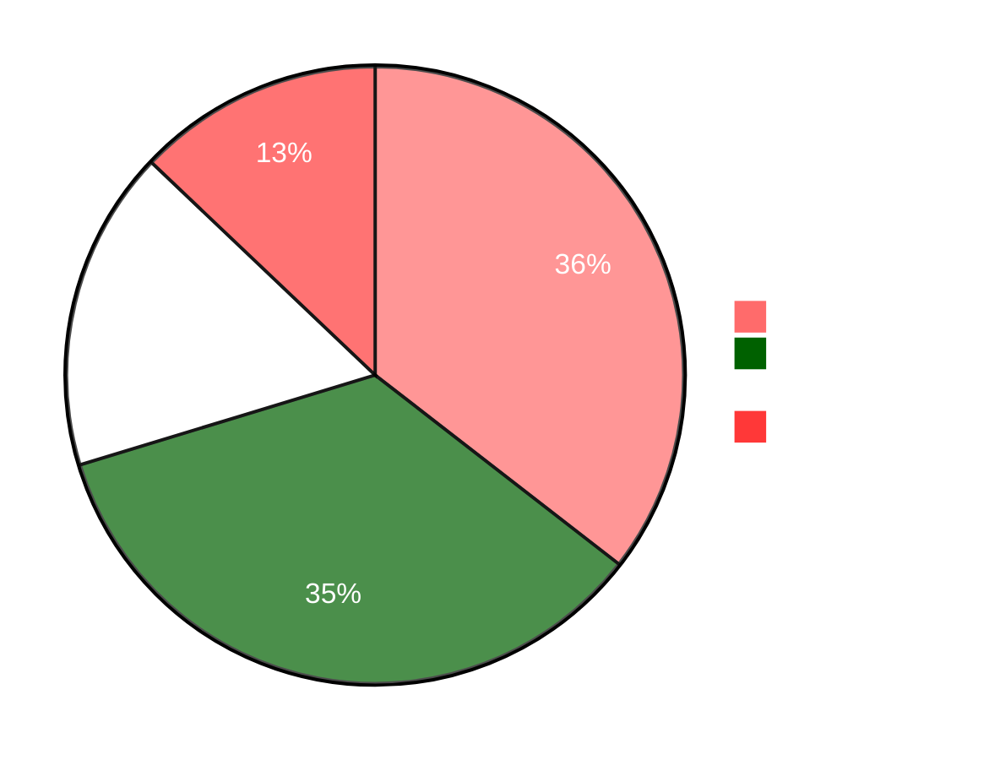

<div align="center">

# 🏨 Hotel Reservation System


[](https://github.com/it24102732/Hotel-Reservation-System)
[](https://github.com/it24102732/Hotel-Reservation-System/stargazers)
[](https://github.com/it24102732/Hotel-Reservation-System/network)
[](https://github.com/it24102732/Hotel-Reservation-System/issues)

<p align="center">
  
  
  
  
</p>

---

### 📖 A modern hotel reservation system built as a Year 2 Semester 1 Software Engineering project

[Features](#-features) • [Tech Stack](#-technology-stack) • [Installation](#-installation) • [Usage](#-usage) • [Screenshots](#-screenshots) • [Contributing](#-contributing)

</div>

---

## 🎯 Project Overview

The **Hotel Reservation System** is a comprehensive web-based application designed to revolutionize the hotel booking experience. Built with modern technologies and best practices, this system provides an intuitive platform for customers to search, book, and manage their hotel reservations seamlessly.

<details>
<summary>📋 <b>Click to expand project goals</b></summary>

- ✅ Provide a user-friendly interface for hotel booking
- ✅ Streamline room availability checking
- ✅ Implement secure payment processing
- ✅ Enable efficient booking management
- ✅ Offer administrative controls for hotel staff
- ✅ Demonstrate software engineering principles and best practices

</details>

---

## ✨ Features

<table>
<tr>
<td width="50%">

### 👥 For Customers
- 🔐 **User Authentication**
  - Secure registration and login
  - Profile management
  - Password recovery

- 🔍 **Smart Search**
  - Filter by dates, room type, and price
  - Real-time availability checking
  - Advanced search options

- 🛏️ **Booking Management**
  - Easy reservation process
  - Booking history
  - Modification and cancellation

</td>
<td width="50%">

### 👨‍💼 For Administrators
- 📊 **Dashboard**
  - Overview of bookings and revenue
  - Occupancy statistics
  - Customer insights

- 🏨 **Room Management**
  - Add/Edit/Delete rooms
  - Set pricing and availability
  - Room categorization

- 💳 **Payment Processing**
  - Secure payment integration
  - Transaction history
  - Invoice generation

</td>
</tr>
</table>

---

## 🛠️ Technology Stack

<div align="center">



</div>

| Technology | Purpose | Percentage |
|:-----------|:--------|:----------:|
|  **Java** | Backend logic & server-side processing | **35.5%** |
|  **HTML** | Structure & markup | **34.8%** |
|  **CSS** | Styling & animations | **16.8%** |
|  **JavaScript** | Client-side interactivity | **12.9%** |

---

## 🚀 Installation

### Prerequisites

Before you begin, ensure you have the following installed:

- ☕ **Java JDK** (version 8 or higher)
- 🌐 **Apache Tomcat** or similar servlet container
- 💾 **MySQL** or your preferred database
- 🔧 **Maven** or **Gradle** (if applicable)

### Step-by-Step Guide

```bash
# 1️⃣ Clone the repository
git clone https://github.com/it24102732/Hotel-Reservation-System.git

# 2️⃣ Navigate to the project directory
cd Hotel-Reservation-System

# 3️⃣ Configure the database
# Edit the database configuration file with your credentials
# (Usually found in src/main/resources/ or WEB-INF/)

# 4️⃣ Build the project (if using Maven)
mvn clean install

# 5️⃣ Deploy to your servlet container
# Copy the generated WAR file to your Tomcat webapps directory
# Or run using your IDE's built-in server

# 6️⃣ Access the application
# Open your browser and navigate to:
# http://localhost:8080/Hotel-Reservation-System
```

<details>
<summary>🔧 <b>Database Setup Instructions</b></summary>

1. Create a new database:
   ```sql
   CREATE DATABASE hotel_reservation_db;
   ```

2. Import the database schema (if provided):
   ```bash
   mysql -u username -p hotel_reservation_db < database/schema.sql
   ```

3. Update connection settings in your configuration file

</details>

---

## 💻 Usage

### For Customers

1. **Registration/Login**
   ```
   Navigate to the homepage → Click "Sign Up" or "Login"
   ```

2. **Search for Rooms**
   ```
   Enter check-in and check-out dates → Select room preferences → Click "Search"
   ```

3. **Make a Reservation**
   ```
   Choose a room → Fill in guest details → Proceed to payment → Confirm booking
   ```

4. **Manage Bookings**
   ```
   Go to "My Bookings" → View/Modify/Cancel reservations
   ```

### For Administrators

1. **Access Admin Panel**
   ```
   Login with admin credentials → Navigate to Dashboard
   ```

2. **Manage Rooms**
   ```
   Go to "Room Management" → Add/Edit/Delete rooms → Set pricing
   ```

3. **View Reports**
   ```
   Navigate to "Reports" → View booking statistics and revenue
   ```

---

## 📁 Project Structure

```
Hotel-Reservation-System/
│
├── 📂 src/
│   ├── 📂 main/
│   │   ├── 📂 java/              # Java source files
│   │   │   ├── 📂 controllers/   # Servlet controllers
│   │   │   ├── 📂 models/        # Data models
│   │   │   ├── 📂 dao/           # Database access objects
│   │   │   └── 📂 utils/         # Utility classes
│   │   │
│   │   ├── 📂 resources/         # Configuration files
│   │   │   └── 📄 db.properties  # Database configuration
│   │   │
│   │   └── 📂 webapp/            # Web content
│   │       ├── 📂 css/           # Stylesheets
│   │       ├── 📂 js/            # JavaScript files
│   │       ├── 📂 images/        # Image assets
│   │       └── 📂 WEB-INF/       # Web configuration
│   │           └── 📄 web.xml    # Deployment descriptor
│   │
│   └── 📂 test/                  # Test files
│
├── 📂 database/                  # Database scripts
│   └── 📄 schema.sql
│
├── 📄 pom.xml                    # Maven configuration
├── 📄 README.md                  # Project documentation
└── 📄 .gitignore                 # Git ignore file
```

---

## 📸 Screenshots

<div align="center">

### 🏠 Homepage


### 🔍 Search & Booking


### 📊 Admin Dashboard


</div>

> 💡 **Tip:** Replace the placeholder images above with actual screenshots of your application!

---

## 🎨 Key Highlights

<div align="center">

| 🚀 Fast | 🔒 Secure | 📱 Responsive | ⚡ Real-time |
|:-------:|:---------:|:-------------:|:-----------:|
| Optimized performance | Data encryption | Mobile-friendly | Live updates |

</div>

---

## 🗺️ Roadmap

- [x] ✅ Basic booking functionality
- [x] ✅ User authentication
- [x] ✅ Admin dashboard
- [ ] 🔄 Email notifications
- [ ] 🔄 Payment gateway integration
- [ ] 🔄 Multi-language support
- [ ] 🔄 Mobile application
- [ ] 🔄 Advanced reporting features

---

## 🤝 Contributing

Contributions are what make the open-source community such an amazing place to learn, inspire, and create. Any contributions you make are **greatly appreciated**!

1. 🍴 Fork the Project
2. 🌿 Create your Feature Branch (`git checkout -b feature/AmazingFeature`)
3. 💾 Commit your Changes (`git commit -m 'Add some AmazingFeature'`)
4. 📤 Push to the Branch (`git push origin feature/AmazingFeature`)
5. 🔃 Open a Pull Request

---

## 📝 License

This project is part of a Year 2 Semester 1 Software Engineering academic project.

---

## 👨‍💻 Author

<div align="center">

**IT24102732**

[](https://github.com/it24102732)

</div>

---

## 🙏 Acknowledgments

- 🎓 University faculty and supervisors
- 📚 Course materials and resources
- 💡 Open-source community
- 🤝 Project team members

---

<div align="center">

### ⭐ If you find this project useful, please consider giving it a star!


**Made with ❤️ for Software Engineering Course**

</div>
