<div align="center">

# 🏨 Hotel Reservation System


<p align="center">
  
</p>

[](https://github.com/it24102732/Hotel-Reservation-System)
[](https://github.com/it24102732/Hotel-Reservation-System/stargazers)
[](https://github.com/it24102732/Hotel-Reservation-System/network)
[](https://github.com/it24102732/Hotel-Reservation-System/issues)
[](https://github.com/it24102732/Hotel-Reservation-System/commits)

<p align="center">
  
  
  
  
  
  
  
  
</p>

---

### 📖 A Modern Full-Stack Hotel Reservation Platform
**Year 2 Semester 1 Software Engineering Project**

A comprehensive hotel booking system built with Spring Boot 3.5.6 and Java 21, demonstrating modern web development practices including MVC architecture, JPA/Hibernate ORM, email notifications, and PDF invoice generation.

[🚀 Quick Start](#-quick-start) • [✨ Features](#-key-features) • [🛠️ Tech Stack](#️-technology-stack) • [📦 Installation](#-installation-guide) • [📚 API Docs](#-api-documentation) • [🤝 Contributing](#-contributing)

</div>

---

## 🎯 Project Overview

<table>
<tr>
<td width="50%">

### 🌟 What is This?

A **full-stack hotel reservation system** that streamlines the entire booking process from room search to invoice generation. Built with enterprise-grade technologies and following software engineering best practices.

### 🎓 Learning Outcomes

- ✅ Spring Boot application development
- ✅ RESTful API design
- ✅ Database design with JPA/Hibernate
- ✅ Server-side rendering with Thymeleaf
- ✅ Email integration (Spring Mail)
- ✅ PDF generation (OpenHTMLToPDF)
- ✅ Responsive web design
- ✅ MVC architecture pattern

</td>
<td width="50%">

### 🔑 System Flow

```mermaid
graph LR
    A[👤 User] -->|Search| B[🏨 Rooms]
    B -->|Select| C[📝 Booking]
    C -->|Confirm| D[💳 Payment]
    D -->|Success| E[📧 Email]
    E -->|Generate| F[📄 PDF Invoice]
    
    G[👨‍💼 Admin] -->|Manage| H[🛠️ System]
    H -->|Monitor| I[📊 Analytics]
    
    style A fill:#FF6B6B
    style G fill:#4D96FF
    style F fill:#6BCB77
```



</td>
</tr>
</table>

---

## ✨ Key Features

<div align="center">

### 👥 Customer Features

<table>
<tr>
<td align="center" width="33%">

#### 🔐 User Authentication


- User registration & login
- Email verification
- Password encryption
- Session management
- Remember me functionality

</td>
<td align="center" width="33%">

#### 🔍 Room Search


- Search by date range
- Filter by room type
- Price range filtering
- Real-time availability
- Advanced search options

</td>
<td align="center" width="33%">

#### 🛏️ Booking System


- Simple booking flow
- Booking confirmation
- Modify/Cancel bookings
- Booking history
- Status tracking

</td>
</tr>
<tr>
<td align="center" width="33%">

#### 📧 Email Notifications


- Booking confirmations
- Reminder emails
- Cancellation alerts
- Password reset
- Promotional updates

</td>
<td align="center" width="33%">

#### 💳 Payment Tracking


- Payment processing
- Transaction history
- Payment verification
- Refund management
- Receipt generation

</td>
<td align="center" width="33%">

#### 📄 PDF Invoices


- Auto-generate invoices
- Download receipts
- Booking details
- Payment breakdown
- Professional formatting

</td>
</tr>
</table>

---

### 👨‍💼 Administrator Features

<table>
<tr>
<td align="center" width="25%">

#### 📊 Dashboard


- Revenue metrics
- Occupancy rates
- Booking analytics
- Real-time statistics

</td>
<td align="center" width="25%">

#### 🏨 Room Management


- Add/Edit/Delete rooms
- Pricing management
- Availability control
- Amenity configuration

</td>
<td align="center" width="25%">

#### 👥 User Management


- View all users
- Activity monitoring
- Role management
- Access control

</td>
<td align="center" width="25%">

#### 📈 Reports


- Financial reports
- Booking statistics
- Export to PDF/Excel
- Custom date ranges

</td>
</tr>
</table>

</div>

---

## 🛠️ Technology Stack

<div align="center">

### Backend Technologies

<table>
<tr>
<td align="center" width="20%">

<br><strong>Java 21 LTS</strong>
<br><sub>Programming Language</sub>
</td>
<td align="center" width="20%">

<br><strong>Spring Boot 3.5.6</strong>
<br><sub>Backend Framework</sub>
</td>
<td align="center" width="20%">

<br><strong>Spring Data JPA</strong>
<br><sub>ORM Framework</sub>
</td>
<td align="center" width="20%">

<br><strong>MySQL</strong>
<br><sub>Database</sub>
</td>
<td align="center" width="20%">

<br><strong>Maven</strong>
<br><sub>Build Tool</sub>
</td>
</tr>
</table>

### Frontend Technologies

<table>
<tr>
<td align="center" width="25%">

<br><strong>Thymeleaf</strong>
<br><sub>Template Engine</sub>
</td>
<td align="center" width="25%">

<br><strong>HTML5</strong>
<br><sub>Markup</sub>
</td>
<td align="center" width="25%">

<br><strong>CSS3</strong>
<br><sub>Styling</sub>
</td>
<td align="center" width="25%">

<br><strong>JavaScript</strong>
<br><sub>Interactivity</sub>
</td>
</tr>
</table>

### Key Dependencies

| Component | Technology | Version | Purpose |
|-----------|-----------|---------|---------|
| 📧 **Email** | Spring Mail | Latest | Email notifications |
| 📄 **PDF** | OpenHTMLToPDF | 1.0.10 | Invoice generation |
| ✅ **Validation** | Bean Validation | Latest | Form validation |
| 🔄 **DevTools** | Spring Boot DevTools | Latest | Development aid |
| 📊 **Monitoring** | Spring Actuator | Latest | Health checks |

</div>

---

## 🚀 Quick Start

### 📋 Prerequisites

Ensure you have the following installed:

| Requirement | Version | Download |
|------------|---------|----------|
| ☕ **Java JDK** | 21+ | [Download](https://www.oracle.com/java/technologies/downloads/) |
| 🔧 **Maven** | 3.6+ | [Download](https://maven.apache.org/download.cgi) |
| 🗄️ **MySQL** | 5.7+ or 8.0+ | [Download](https://dev.mysql.com/downloads/mysql/) |
| 📝 **Git** | Latest | [Download](https://git-scm.com/downloads) |

---

## 📦 Installation Guide

### Step 1️⃣: Clone the Repository

```bash
git clone https://github.com/it24102732/Hotel-Reservation-System.git
cd Hotel-Reservation-System
```

### Step 2️⃣: Database Setup

```sql
-- Login to MySQL
mysql -u root -p

-- Create database
CREATE DATABASE hotel_reservation_db CHARACTER SET utf8mb4 COLLATE utf8mb4_unicode_ci;

-- Create user (optional)
CREATE USER 'hotel_user'@'localhost' IDENTIFIED BY 'secure_password';
GRANT ALL PRIVILEGES ON hotel_reservation_db.* TO 'hotel_user'@'localhost';
FLUSH PRIVILEGES;
```

### Step 3️⃣: Configure Application

Create `src/main/resources/application.properties`:

```properties
# ========================================
# SERVER CONFIGURATION
# ========================================
server.port=8080

# ========================================
# DATABASE CONFIGURATION
# ========================================
spring.datasource.url=jdbc:mysql://localhost:3306/hotel_reservation_db?useSSL=false&serverTimezone=UTC&allowPublicKeyRetrieval=true
spring.datasource.username=hotel_user
spring.datasource.password=secure_password
spring.datasource.driver-class-name=com.mysql.cj.jdbc.Driver

# ========================================
# JPA/HIBERNATE CONFIGURATION
# ========================================
spring.jpa.hibernate.ddl-auto=update
spring.jpa.show-sql=true
spring.jpa.properties.hibernate.dialect=org.hibernate.dialect.MySQL8Dialect
spring.jpa.properties.hibernate.format_sql=true

# ========================================
# THYMELEAF CONFIGURATION
# ========================================
spring.thymeleaf.cache=false
spring.thymeleaf.prefix=classpath:/templates/
spring.thymeleaf.suffix=.html

# ========================================
# EMAIL CONFIGURATION
# ========================================
spring.mail.host=smtp.gmail.com
spring.mail.port=587
spring.mail.username=your-email@gmail.com
spring.mail.password=your-app-password
spring.mail.properties.mail.smtp.auth=true
spring.mail.properties.mail.smtp.starttls.enable=true

# ========================================
# LOGGING
# ========================================
logging.level.root=INFO
logging.level.com.hotelmanagement=DEBUG
```

> ⚠️ **Important**: Use Gmail App Password, not your regular password!

### Step 4️⃣: Build the Project

```bash
# Clean and build
mvn clean install

# Skip tests (if needed)
mvn clean install -DskipTests
```

### Step 5️⃣: Run the Application

```bash
# Option 1: Maven
mvn spring-boot:run

# Option 2: JAR file
java -jar target/system-0.0.1-SNAPSHOT.jar

# Option 3: IDE
# Run HotelManagementApplication.java main method
```

### Step 6️⃣: Access the Application

```
🌐 Homepage:      http://localhost:8080
👤 Login:         http://localhost:8080/login
📝 Register:      http://localhost:8080/register
👨‍💼 Admin:        http://localhost:8080/admin
📊 Health:        http://localhost:8080/actuator/health
```

---

## 📁 Project Structure

```
Hotel-Reservation-System/
│
├── 📂 src/
│   ├── 📂 main/
│   │   ├── 📂 java/com/hotelmanagement/
│   │   │   ├── 📂 controller/          # MVC Controllers
│   │   │   ├── 📂 model/               # JPA Entities
│   │   │   ├── 📂 repository/          # Data Access Layer
│   │   │   ├── 📂 service/             # Business Logic
│   │   │   ├── 📂 config/              # Configuration
│   │   │   ├── 📂 dto/                 # Data Transfer Objects
│   │   │   └── 📄 Application.java     # Main Class
│   │   │
│   │   └── 📂 resources/
│   │       ├── 📂 templates/           # Thymeleaf Templates
│   │       │   ├── 📄 index.html
│   │       │   ├── 📄 login.html
│   │       │   ├── 📄 rooms.html
│   │       │   └── 📂 admin/
│   │       │
│   │       ├── 📂 static/              # Static Resources
│   │       │   ├── 📂 css/
│   │       │   ├── 📂 js/
│   │       │   └── 📂 images/
│   │       │
│   │       └── 📄 application.properties
│   │
│   └── 📂 test/                        # Test Files
│
├── 📄 pom.xml                          # Maven Configuration
├── 📄 README.md                        # Documentation
└── 📄 .gitignore
```

---

## 📚 API Documentation

<details>
<summary><b>🔐 Authentication Endpoints</b></summary>

### Register User
```http
POST /api/auth/register
Content-Type: application/json

{
  "email": "user@example.com",
  "password": "password123",
  "firstName": "John",
  "lastName": "Doe"
}
```

### Login
```http
POST /api/auth/login
Content-Type: application/json

{
  "email": "user@example.com",
  "password": "password123"
}
```

</details>

<details>
<summary><b>🏨 Room Endpoints</b></summary>

### Get All Rooms
```http
GET /api/rooms
```

### Search Rooms
```http
GET /api/rooms/search?checkIn=2025-01-01&checkOut=2025-01-05&type=DELUXE
```

### Get Room Details
```http
GET /api/rooms/{id}
```

</details>

<details>
<summary><b>📅 Booking Endpoints</b></summary>

### Create Booking
```http
POST /api/bookings
Content-Type: application/json

{
  "roomId": 1,
  "checkIn": "2025-01-01",
  "checkOut": "2025-01-05",
  "guests": 2
}
```

### Get User Bookings
```http
GET /api/bookings/user/{userId}
```

### Download Invoice
```http
GET /api/bookings/{id}/invoice
```

</details>

---

## 🧪 Testing

### Run Tests
```bash
mvn test
```

### Generate Coverage Report
```bash
mvn jacoco:report
```

---

## 🐛 Troubleshooting

<details>
<summary><b>❌ Common Issues</b></summary>

### MySQL Connection Error
```bash
# Check MySQL status
sudo systemctl status mysql

# Start MySQL
sudo systemctl start mysql
```

### Port 8080 Already in Use
```bash
# Find process
lsof -ti :8080

# Kill process
kill -9 $(lsof -ti :8080)
```

### Email Not Sending
- Use Gmail App Password
- Enable 2-Step Verification
- Check firewall settings

</details>

---

## 🗺️ Roadmap

### ✅ Completed
- [x] User authentication
- [x] Room management
- [x] Booking system
- [x] Email notifications
- [x] PDF generation

### 🔄 In Progress
- [ ] Payment gateway integration
- [ ] Multi-language support
- [ ] Mobile responsive design

### 📋 Planned
- [ ] Review & rating system
- [ ] Loyalty program
- [ ] SMS notifications
- [ ] Advanced analytics

---

## 🤝 Contributing

Contributions are welcome! Please follow these steps:

1. **Fork** the repository
2. **Create** a feature branch (`git checkout -b feature/amazing`)
3. **Commit** your changes (`git commit -m 'Add feature'`)
4. **Push** to branch (`git push origin feature/amazing`)
5. **Open** a Pull Request

---

## 📄 License

This is an **academic project** for Year 2 Semester 1 Software Engineering course.

```
Academic License - Educational Use Only
Not for commercial distribution
```

---

## 👨‍💻 Developer

<div align="center">

### **IT24102732**

[](https://github.com/it24102732)
[](mailto:it24102732@example.com)

</div>

---

## 🙏 Acknowledgments

<div align="center">

| Category | Thanks To |
|----------|-----------|
| 🎓 **Academic** | University Faculty & SE Instructors |
| 📚 **Resources** | Spring Boot & Java Community |
| 💡 **Tools** | IntelliJ IDEA, MySQL Workbench |
| 🌟 **Inspiration** | Open Source Community |

</div>

---

## 📞 Support

<div align="center">

| Channel | Link |
|---------|------|
| 🐛 **Issues** | [Report Bug](https://github.com/it24102732/Hotel-Reservation-System/issues) |
| ✨ **Features** | [Request Feature](https://github.com/it24102732/Hotel-Reservation-System/issues/new) |
| 💬 **Discuss** | [Discussions](https://github.com/it24102732/Hotel-Reservation-System/discussions) |

</div>

---

<div align="center">

### ⭐ Star this repository if you found it helpful!


**Made with ❤️ for Software Engineering Education**


</div>
